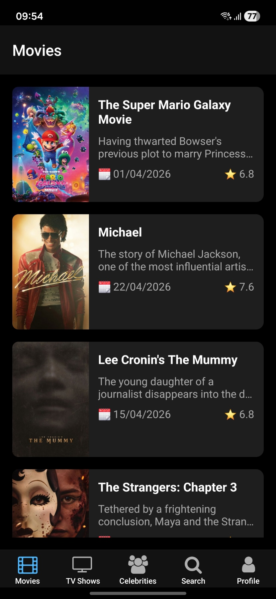
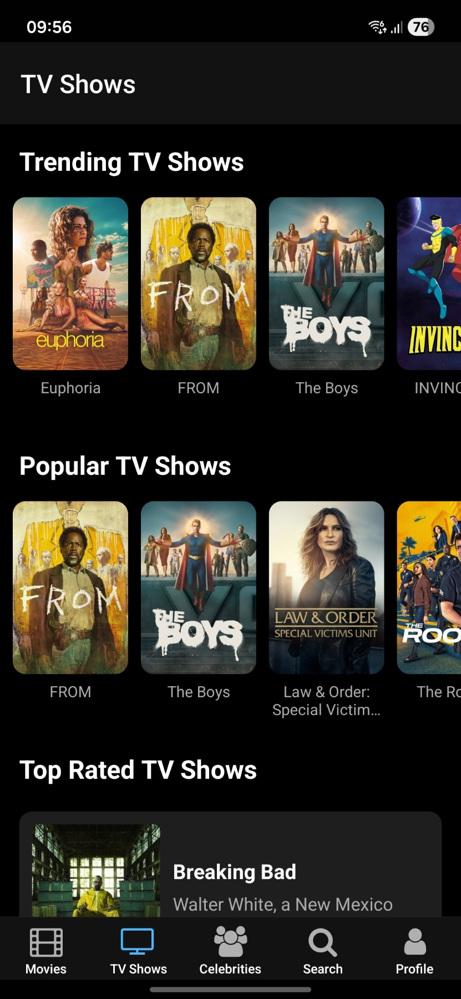
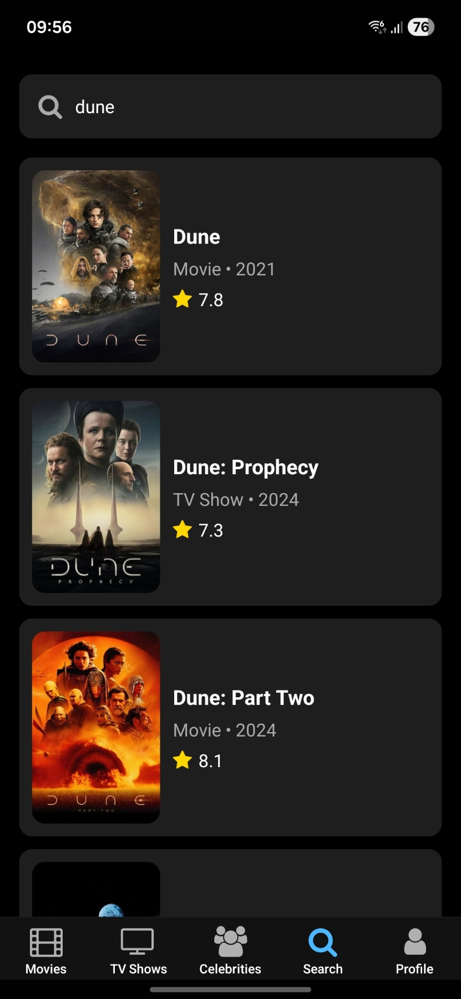
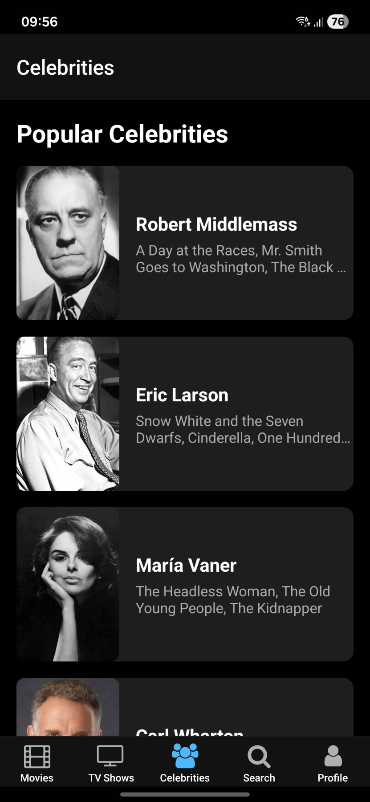
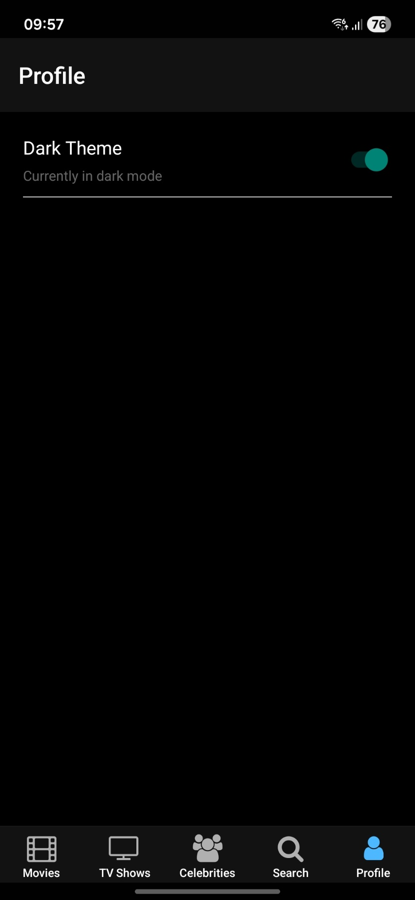

# 🎬 Movie Expo App

A comprehensive movie and TV show discovery app built with React Native and Expo. Browse trending movies, discover new TV shows, explore celebrity profiles, and keep track of your favorite content.

## ✨ Features

- 🎥 **Movies**: Browse trending, popular, and upcoming movies
- 📺 **TV Shows**: Discover popular TV series and episodes
- ⭐ **Celebrities**: Explore actor and director profiles
- 🔍 **Search**: Find movies, TV shows, and celebrities
- 👤 **Profile**: Manage your watchlist and preferences
- 📱 **Cross-platform**: Works on iOS, Android, and Web
- 🎨 **Modern UI**: Beautiful, responsive design with smooth animations

## 📱 Screenshots

> **Note**: Add your app screenshots here to showcase the different screens and features

### Home Screen

*Add screenshot of the main home/movies screen*

### TV Shows

*Add screenshot of the TV shows browsing screen*

### Search

*Add screenshot of the search functionality*

### Celebrity Profiles

*Add screenshot of celebrity profiles screen*

### User Profile

*Add screenshot of user profile and settings*

## 🚀 Getting Started

### Prerequisites

- Node.js (v16 or later)
- npm or yarn
- Expo CLI
- iOS Simulator (for iOS development)
- Android Studio (for Android development)

### Installation

1. **Clone the repository**
   ```bash
   git clone <your-repo-url>
   cd movie-expo-app
   ```

2. **Install dependencies**
   ```bash
   npm install
   ```

3. **Start the development server**
   ```bash
   npx expo start
   ```

4. **Run on your preferred platform**
   
   In the terminal output, you'll find options to open the app in:
   - Press `i` for iOS simulator
   - Press `a` for Android emulator  
   - Press `w` for web browser
   - Scan QR code with Expo Go app on your device

## 🛠️ Development

### Project Structure

```
movie-expo-app/
├── app/                    # Main application code
│   ├── (tabs)/            # Tab-based navigation screens
│   │   ├── movies.tsx     # Movies browsing screen
│   │   ├── tv-shows.tsx   # TV shows screen
│   │   ├── celebrities.tsx # Celebrity profiles
│   │   ├── search.tsx     # Search functionality
│   │   └── profile.tsx    # User profile
│   ├── movie/             # Individual movie details
│   ├── tv-show/           # TV show details
│   ├── celebrities/       # Celebrity detail pages
│   └── hooks/             # Custom React hooks
├── assets/                # Images, fonts, and other assets
└── components/            # Reusable UI components
```

### Available Scripts

- `npm start` - Start the Expo development server
- `npm run android` - Run on Android device/emulator
- `npm run ios` - Run on iOS device/simulator
- `npm run web` - Run in web browser
- `npm test` - Run tests with Jest
- `npm run lint` - Run ESLint for code quality

### Key Dependencies

- **Expo Router** - File-based navigation
- **React Navigation** - Navigation library
- **Expo AV** - Audio and video playback
- **React Native Reanimated** - Smooth animations
- **Expo Vector Icons** - Icon library
- **AsyncStorage** - Local data persistence

## 🎯 Features in Detail

### Movies Section
- Browse trending and popular movies
- View detailed movie information
- Watch trailers and clips
- Add movies to watchlist

### TV Shows Section  
- Discover popular TV series
- Browse by genre and rating
- Track episodes and seasons
- Get recommendations

### Search Functionality
- Search across movies, TV shows, and celebrities
- Filter and sort results
- Advanced search options
- Search history

### Celebrity Profiles
- View actor and director information
- Browse filmography
- See upcoming projects
- Biography and career highlights

## 🔒 Security

This project follows security best practices:

- **API Keys**: All sensitive data is stored in environment variables
- **Environment Files**: `.env` files are excluded from version control
- **Template Provided**: Use `.env.example` as a template for setup
- **No Hardcoded Secrets**: All API keys are loaded from environment variables

### Before Contributing
1. Never commit API keys or sensitive data
2. Use the provided `.env.example` template
3. Ensure your `.env` file is in `.gitignore`
4. Test with your own API keys locally

## 🔧 Configuration

### Environment Setup

1. **Copy the environment template**
   ```bash
   cp .env.example .env
   ```

2. **Add your TMDB API key**
   - Get your API key from [TMDB API Settings](https://www.themoviedb.org/settings/api)
   - Open `.env` file and replace `your_tmdb_api_key_here` with your actual API key
   
   ```env
   TMDB_API_KEY=your_actual_api_key_here
   ```

3. **Important Security Notes**
   - Never commit your `.env` file to version control
   - The `.env` file is already added to `.gitignore`
   - Use `.env.example` as a template for other developers

### Customization

The app uses Expo's configuration system. Modify `app.json` or `expo.json` to customize:
- App name and description
- Icons and splash screens
- Platform-specific settings
- Build configurations

## 📦 Building for Production

### Development Build
```bash
npx expo run:android
npx expo run:ios
```

### Production Build
```bash
npx expo build:android
npx expo build:ios
```

### Web Deployment
```bash
npx expo export:web
```

## 🤝 Contributing

1. Fork the repository
2. Create a feature branch (`git checkout -b feature/amazing-feature`)
3. Commit your changes (`git commit -m 'Add amazing feature'`)
4. Push to the branch (`git push origin feature/amazing-feature`)
5. Open a Pull Request

## 📄 License

This project is licensed under the MIT License - see the [LICENSE](LICENSE) file for details.

## 🙏 Acknowledgments

- [The Movie Database (TMDB)](https://www.themoviedb.org/) for movie and TV data
- [Expo](https://expo.dev/) for the amazing development platform
- [React Native](https://reactnative.dev/) community for the framework

## 📞 Support

If you have any questions or need help, please:
- Open an issue on GitHub
- Check the [Expo documentation](https://docs.expo.dev/)
- Visit the [React Native community](https://reactnative.dev/community/overview)

---

Built with ❤️ using React Native and Expo
